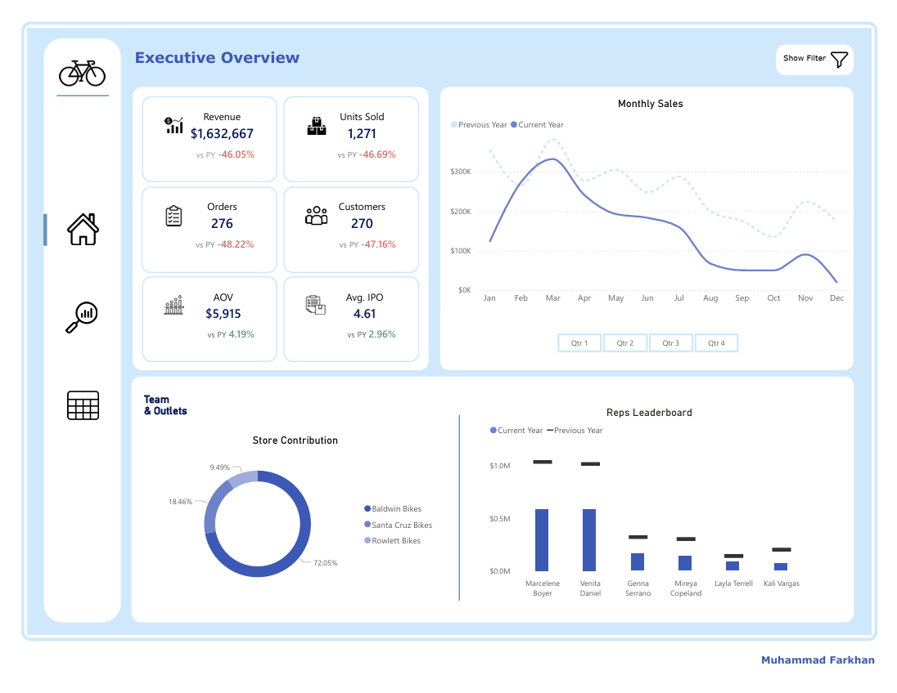

## Sales Performance Analytics | Retail Bicycle Store (2016–2019)

A retail bicycle company lost $1.36 million in revenue in a single year. This project breaks down what happened, where it happened, and what the business should do next.

---

### Project Summary

A four-year sales report and analysis of a retail bicycle business, covering store performance, customer location, brand, product, and sales team activity.

**Dataset:** Bicycle sales transactions from 2016 to 2019. The data includes order date, customer, state, city, store, brand, category, product, sales rep, revenue, units sold, and unit price.

**Tools:** SQL (PostgreSQL), Python, Microsoft Power BI

---

### Workflow

**1. SQL** - Explore and validate raw data, add unit_price column, create a VIEW scoped to 2016–2019

**2. Python** - Load data from SQL VIEW, data cleaning, exploratory data analysis, outlier analysis, export clean table back to PostgreSQL

**3. Power BI** - Connect to clean table, build interactive dashboard with YoY comparison across all metrics

**4. Report** - Summarize findings into insights and recommendations

---

### Insights & Recommendations

Key findings cover six dimensions: time (yearly and monthly trends), customer location, brand, store, product & category, and sales team. The most critical finding is a 46% revenue drop in 2019, caused by a slow decline in customer activity across all regions at the same time, with no area strong enough to cover the loss.

Four recommendations are provided: store evaluation, regional expansion, product category diversification, and short-term brand recovery priority.

[Click here for the full report](report/insights_and_recommendations_sales_analysis.pdf)

---

### Dashboard

[Full dashboard preview](report/preview_dashboard.pdf)

---

### Impact & Use Cases

This project shows how sales data can be used to:

- Find out which stores, regions, or brands are hurting the business
- Spot early warning signs before revenue drops become too big to recover
- Identify which products or categories have the most growth potential
- Help management make decisions based on data, not just gut feeling

The same approach works in any industry where you need to understand what is selling, where, and why — not just bicycle retail.

---

### Repository Structure

| Folder | Contents |
|---|---|
| `dataset/` | Raw dataset |
| `images/` | Dashboard screenshots |
| `notebooks/` | Python analysis notebook |
| `queries/` | SQL preparation queries |
| `report/` | Insights, recommendations, and dashboard preview |

---

### Disclaimer

Insights and recommendations are based on sales transaction data only, without external market data, internal operational data, or stakeholder input.
